## Problem 1

### (a)

For binomial tree model, we set $S= e^x$, $S_u = e^{x+\Delta X_u}$, and $S_d = e^{x+\Delta X_d}$. Assume $\Delta x_u = \Delta x_d$, $\Delta x$ and probability of up move $p_u$ is given by:
$$
\left\{\begin{array}{l}
\Delta x=\sqrt{\left(r-\frac{\sigma^{2}}{2}\right)^{2} \Delta t^{2}+\sigma^{2} \Delta t} \\
p_{u}=\frac{1}{2}+\frac{1}{2} \frac{\left(r-\frac{\sigma^{2}}{2}\right) \Delta t}{\Delta x}
\end{array}\right.
$$

The ```binomial_tree``` function will precompute $\Delta x$ and $p_u$ firstly. And it consists of three subfunctions:

- `tree_construction`: It will return a list containing arrays of stock price at each time period.
- `payoff`: Calculate the payoff of calls and puts.
- `backward`: This function is to calculate the option's payoffs at $t_i$ based on the payoffs at $t_{i+1}$. i.e. It's just one step in the recursion process.

And at last, we use `tree_construction` to construct a tree, and initialize the payoff at the terminal nodes. Then do the recursive calculation until we get the payoff value at time $t=0$.

```python
def binomial_tree(S, K, T, r, sigma, N, Type, style):
    """
    Binomial tree method for option pricing
    :param S: spot price
    :param K: strike
    :param T: time to maturity
    :param r: risk-free interest
    :param sigma: volatility of underlying asset
    :param N: steps of tree
    :param Type: option type, 'c' or 'p'
    :param style: option style, 'a' or 'e'
    :return: price of option interested in
    """
    # check illegal Type and style
    if Type not in ['c', 'p']:
        raise TypeError("option type should be 'c' for call,"
                        "'p' for put")
    if style not in ['e', 'a']:
        raise TypeError("option style should be 'a' for American option,"
                        "'e' for European option")
    # delta_t, delta_x, prob of up and down
    t = T / N
    delta_x = np.sqrt((r - sigma ** 2 / 2) ** 2 * t ** 2 + sigma ** 2 * t)
    p_u = 0.5 + 0.5 * (r - sigma ** 2 / 2) * t / delta_x
    p_d = 1 - p_u

    # construct stock price tree
    def tree_construction():
        s = [np.array([S])]
        for i in range(N):
            temp = np.exp(delta_x) * s[i]
            temp = np.append(temp, s[i][-1] * np.exp(-delta_x))
            s.append(temp)
        return s

    # payoff
    def payoff(s):
        if Type == 'c':
            return np.maximum(s - K, 0)
        elif Type == 'p':
            return np.maximum(K - s, 0)
        else:
            raise TypeError("Illegal option type!")

    # backward calculation
    def backward(s, p):
        temp = np.roll(p, -1)
        temp = p * p_u + temp * p_d
        temp = temp * np.exp(-r * t)
        temp = np.delete(temp, -1)
        if style == 'e':
            return temp
        elif style == 'a':
            current_p = payoff(s)
            temp = np.maximum(temp, current_p)
            return temp

    s = tree_construction()
    # nodes at maturity
    s_t = s[-1]
    # print(s_t)
    p = payoff(s_t)
    while len(p) > 1:
        p = backward(s[len(p) - 2], p)
    return float(p)
```

Use an example to check if the program works properly: (*Example 21-1* from John Hull's book):

```python
if __name__ == '__main__':
    S = 50
    K = 50
    r = 0.1
    sigma = 0.4
    T = 0.4167
    N = 500
    print(binomial_tree(S, K, T, r, sigma, N, 'p', 'a'))
```

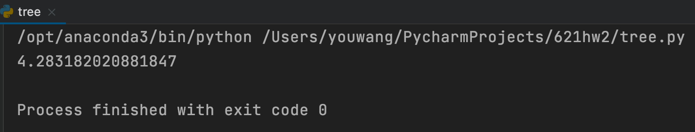

It's is exactly the same with the result in the book.

### (b)

1. Use DATA2 in **Homework 1**(choose SPY option and matures at 3/24, 4/16, 6/28):

    ```python
    import numpy as np
    import pandas as pd
    from tree import *
    data2 = pd.read_pickle('./DATA2.pkl')
    r = 0.07/100
    spy = data2[1]
    spy = [spy[10], spy[13], spy[17]]
    ```

2. Choose options whose strike prices close to the value at the money:

    ```python
    def clean(x):
        info = ['contractSymbol','spotPrice', 'strike', 'bid', 'ask',
                'expiry', 'moneyness', 'delta_t', 'BS_price', 'vol', 'type']
        call = []
        put = []
        for df in x:
            df['moneyness'] = df.spotPrice / df.strike
            df = df[df.moneyness > 0.8]
            df = df[df.moneyness < 1.2]
            df = df[info].reset_index()
            del df['index']
            df = df.dropna()
            y = df[df.type == 'c'].iloc[0:21]
            z = df[df.type == 'p'].iloc[0:21]
            call.append(y)
            put.append(z)
        return call, put

    call, put = clean(spy)
    ```

3. Use `binomial_tree()` function we defined before to calculate price:

    ```python
    def tree_price(x, style):
        if style == 'e':
            col_name = 'euro_price'
        elif style == 'a':
            col_name = 'amer_price'
        for df in x:
            df[col_name] = df.apply(lambda x: binomial_tree(x.spotPrice, x.strike, x.delta_t,
                                                            r,x.vol, 500, x.type, style), axis=1)
                                                        tree_price(call, 'e')
    tree_price(put, 'e')
    tree_price(call, 'a')
    tree_price(put, 'a')
    ```

    Here are the tables of options maturing at 3/21:

    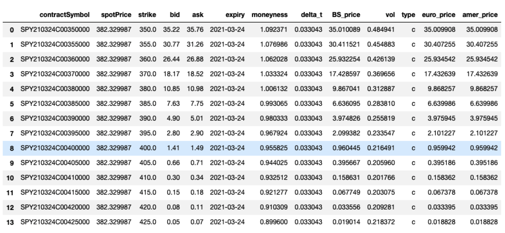

    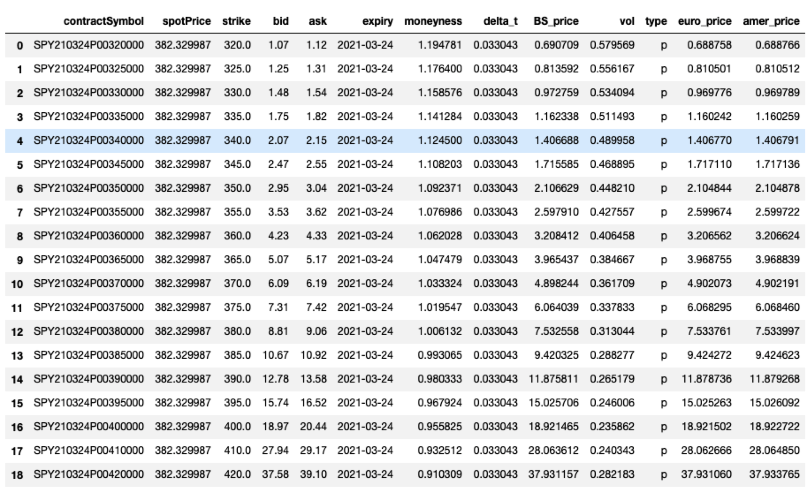

4. Use option matures at 3/24 to do plots:

```python
plt.figure(1)
plt.plot(call[0].bid, label='bid')
plt.plot(call[0].ask, label='ask')
plt.plot(call[0].BS_price, label='BS-price')
plt.plot(call[0].euro_price, label='binomial-tree euro price')
plt.plot(call[0].amer_price, label='binomial-tree amer price')
plt.xlabel('index')
plt.ylabel('price')
plt.title('comparison 1')
plt.legend()

plt.figure(2)
plt.plot(put[0].bid, label='bid')
plt.plot(put[0].ask, label='ask')
plt.plot(put[0].BS_price, label='BS-price')
plt.plot(put[0].euro_price, label='binomial-tree euro price')
plt.plot(put[0].amer_price, label='binomial-tree amer price')
plt.xlabel('index')
plt.ylabel('price')
plt.title('comparison 2')
plt.legend()
plt.show()
```

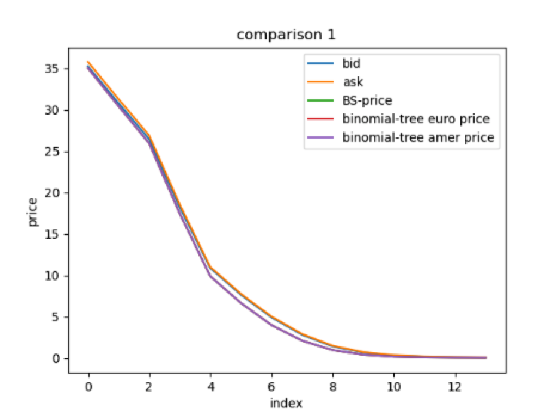

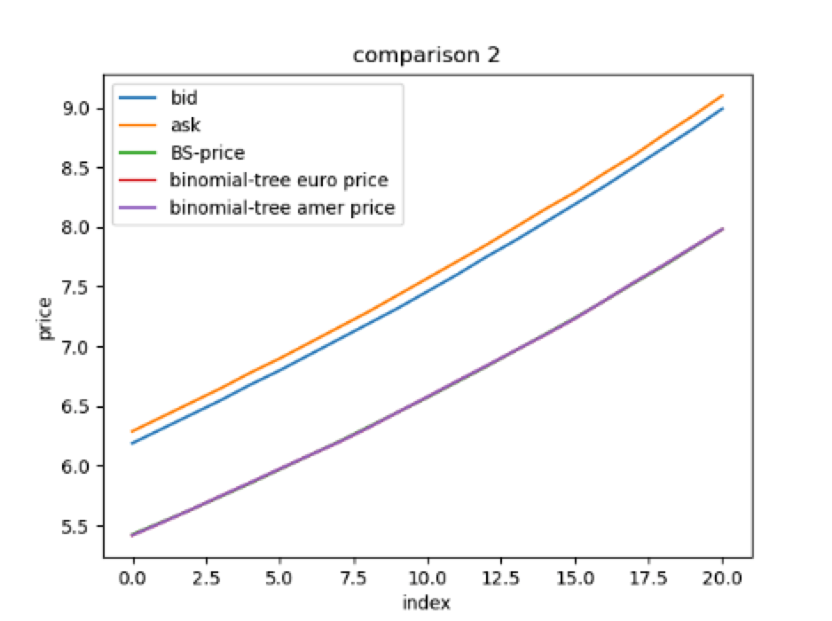

### (c)

By looking at tables and plots:

- In general, price calculated by binomial tree model are very close to the result of BS model.

- For call option, European option and American option calculated by binomial tree are the same; For put option, American option price is slightly larger than European option price.

- Because in DATA2 we use previous day's implied volatility, both prices of Binomial model and BS model are a little bit smaller than bid/ask value.

### (d)

```python
S = 50
K = 50
r = 0.1
sigma = 0.4
T = 0.4167

error = lambda x: abs(BS_formula('c', S, K, T, sigma, r) \
                      - binomial_tree(S, K, T, r, sigma, x, 'c', 'e'))

N = [10, 20, 30, 40, 50, 100, 150, 200, 250, 300, 350, 400]
epsilon = []
for n in N:
    epsilon.append(error(n))
plt.figure(3)
plt.plot(N, epsilon)
plt.xlabel('steps')
plt.ylabel('absolute error')
plt.show()
```

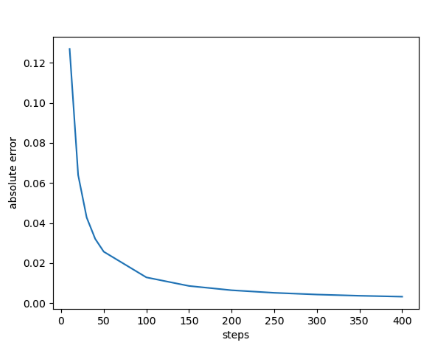

We can observe that absolute error decrease dramatically in 100 steps. And the speed becomes slower as steps go larger.

## Problem 2

### (a)

Similar to binomial tree, the function precomputes $\Delta x$ and $p_u$, $p_m$, $p_d$. And it also contains three subfunctions which have the same algorithm with the functions in `binomial_tree` function. Here we talk about the `backward_barrier` function specifically:

- Actually the `backward_barrier` only works for knock-out options.(for knock-in option, we use In-Out parity to get price).
- For knock-out options, when we do recursive calculations, on the basis of previous algorithm, we need to check if the stock price touches the barrier and knock out.
- The parameter `barrier` is a list containing 3 elements   , elements in it correspond to barrier value, up barrier(U)/lower barrier(D), knock-in/out.

```python
def trinomial_tree(S, K, barrier, T, r, sigma, N, Type, style):
    # check illegal Type and style
    if Type not in ['c', 'p']:
        raise TypeError("option type should be 'c' for call,"
                        "'p' for put")
    if style not in ['e', 'a']:
        raise TypeError("option style should be 'a' for American option,"
                        "'e' for European option")
    # initialization
    t = T / N
    D = r - sigma ** 2 / 2
    delta_x = sigma * np.sqrt(3 * t)
    p_u = 0.5 * ((sigma ** 2 * t + D ** 2 * t ** 2) / delta_x ** 2 + D * t / delta_x)
    p_m = 1 - (sigma ** 2 * t + D ** 2 * t ** 2) / delta_x ** 2
    p_d = 0.5 * ((sigma ** 2 * t + D ** 2 * t ** 2) / delta_x ** 2 - D * t / delta_x)

    def tree_construction():
        s = [np.array([S])]
        for i in range(N):
            temp = np.exp(delta_x) * s[i]
            temp = np.append(temp, s[i][-1])
            temp = np.append(temp, s[i][-1] * np.exp(-delta_x))
            s.append(temp)
        return s

    # payoff
    def payoff(s):
        if Type == 'c':
            return np.maximum(s - K, 0)
        elif Type == 'p':
            return np.maximum(K - s, 0)
        else:
            raise TypeError("Illegal option type!")

    def backward(s, p):
        temp1 = np.roll(p, -1)
        temp2 = np.roll(p, -2)
        temp = p * p_u + temp1 * p_m + temp2 * p_d
        temp = temp * np.exp(-r * t)
        temp = np.delete(temp, -1)
        temp = np.delete(temp, -1)
        if style == 'e':
            return temp
        elif style == 'a':
            current_p = payoff(s)
            temp = np.maximum(temp, current_p)
            return temp

    def backward_barrier(s, p):
        temp1 = np.roll(p, -1)
        temp2 = np.roll(p, -2)
        temp = p * p_u + temp1 * p_m + temp2 * p_d
        temp = temp * np.exp(-r * t)
        temp = np.delete(temp, -1)
        temp = np.delete(temp, -1)
        if barrier[1] == 'D':
            temp[s <= barrier[0]] = 0
            if style == 'e':
                return temp
            elif style == 'a':
                current_p = payoff(s)
                temp = np.maximum(temp, current_p)
                temp[s <= barrier[0]] = 0
                return temp
        elif barrier[1] == 'U':
            temp[s >= barrier[0]] = 0
            if style == 'e':
                return temp
            elif style == 'a':
                current_p = payoff(s)
                temp = np.maximum(temp, current_p)
                temp[s >= barrier[0]] = 0
                return temp

    s = tree_construction()
    s_t = s[-1]
    p = payoff(s_t)
    # without barrier
    if barrier == 0:
        p = payoff(s_t)
        while len(p) > 1:
            p = backward(s[len(p) // 2 - 1], p)
        return float(p)

    # with barrier
    if barrier[1] == 'D':
        p[s_t <= barrier[0]] = 0
    elif barrier[1] == 'U':
        p[s_t >= barrier[0]] = 0
    if barrier[2] == 'O':
        while len(p) > 1:
            p = backward_barrier(s[len(p) // 2 - 1], p)
        return float(p)
    elif barrier[2] == 'I':
        out = trinomial_tree(S, K, [barrier[0], barrier[1], 'O'], T, r, sigma, N, Type, style)
        v = trinomial_tree(S, K, 0, T, r, sigma, N, Type, style)
        return v - out
```

Input the parameters given in this problem:

```python
if __name__ == '__main__':
    print(trinomial_tree(10, 10, [11, 'U', 'O'], 0.3, 0.01, 0.2, 8000, 'c', 'e'))
```

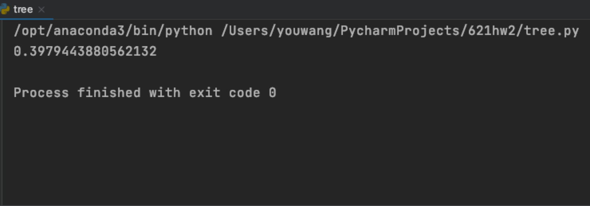

Here use 8000 steps to calculate the price, it's $0.05534.

### (b)

For the European Up-and-Out Call option explicit formula is:

$$
\begin{aligned}
U O_{B S} &=C_{B S}(S, K)-C_{B S}(S, H)-(H-K) e^{-r T} \Phi\left(d_{B S}(S, H)\right) \\
&-\left(\frac{H}{S}\right)^{\frac{2 v}{\sigma^{2}}}\left\{C_{B S}\left(\frac{H^{2}}{S}, K\right)-C_{B S}\left(\frac{H^{2}}{S}, H\right)-(H-K) e^{-r T} \Phi\left(d_{B S}(H, S)\right)\right\}
\end{aligned}
$$

It's straightforward so we can directly define the function of Up-and-Out option:

```python
def BS_formula(Type, S, K, T, sigma, r):
    d1 = (np.log(S / K) + (r + sigma ** 2 / 2) * T) / (sigma * np.sqrt(T))
    d2 = d1 - sigma * np.sqrt(T)
    if Type == 'c':
        return norm.cdf(d1) * S - norm.cdf(d2) * K * np.exp(-r * T)
    elif Type == 'p':
        return K * np.exp(-r * T) * norm.cdf(-d2) - norm.cdf(-d1) * S
    else:
        raise TypeError("Type must be 'c' for call, 'p' for put")


def UO_call(S, K, T, r, sigma, H):
    nu = r - sigma ** 2 / 2

    def bs(S_, K_):
        return BS_formula('c', S_, K_, T, sigma, r)

    def dbs(S_, K_):
        return (np.log(S_ / K_) + nu * T) / (sigma * np.sqrt(T))

    c1 = bs(S, K)
    c2 = bs(S, H)
    c3 = bs(H ** 2 / S, K)
    c4 = bs(H ** 2 / S, H)
    d1 = dbs(S, H)
    d2 = dbs(H, S)

    temp1 = c1 - c2 - (H - K) * np.exp(-r * T) * norm.cdf(d1)
    temp2 = (H / S) ** (2 * nu / sigma ** 2) * (c3 - c4 - (H - K) * np.exp(-r * T) * norm.cdf(d2))
    return temp1 - temp2
```

Run the following code:

```python
S = 10
K = 10
T = 0.3
sigma = 0.2
r = 0.01
H = 11

res1 = UO_call(S, K, T, r, sigma, H)
res2= trinomial_tree(S, K, [H, 'U', 'O'], T, r, sigma, 8000, 'c', 'e')

print("explicit formula result for up-and-out option: ", res1)
print("trinomial tree result for up-and-out option: ", res2)
```

The result is:

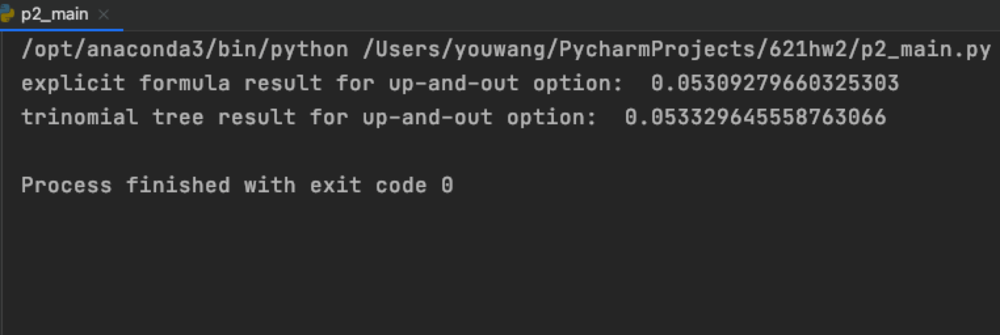

Results calculated by two methods are very close to each other.

### (c)

First we define the function of explicit formula for Up-and-In call option:

```python
def UI_call(S, K, T, r, sigma, H):
    nu = r - sigma ** 2 / 2

    def bsp(S_, K_):
        return BS_formula('p', S_, K_, T, sigma, r)

    def bsc(S_, K_):
        return BS_formula('c', S_, K_, T, sigma, r)

    def dbs(S_, K_):
        return (np.log(S_ / K_) + nu * T) / (sigma * np.sqrt(T))

    p1 = bsp(H ** 2 / S, K)
    p2 = bsp(H ** 2 / S, H)
    d1 = dbs(H, S)
    d2 = dbs(S, H)
    c1 = bsc(S, H)

    temp1 = (H / S) ** (2 * nu / sigma ** 2) * (p1 - p2 + (H - K) * np.exp(-r * T) * norm.cdf(-d1))
    temp2 = c1 + (H - K) * np.exp(-r * T) * norm.cdf(d2)
    return temp1 + temp2
```

Then compare the result:

```python
S = 10
K = 10
T = 0.3
sigma = 0.2
r = 0.01
H = 11

res3 = UI_call(S, K, T, r, sigma, H)
res4 = trinomial_tree(S, K, [H, 'U', 'I'], T, r, sigma, 8000, 'c', 'e')


```

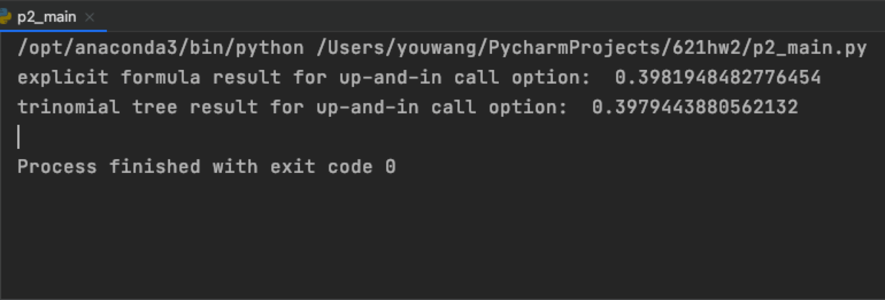

Obviously the results are still matching.

### (d)

Use the same parameter of (b):

```python
res5 = trinomial_tree(S, K, [H, 'U', 'I'], T, r, sigma, 8000, 'c', 'a')
print("trinomial tree result for American up-and-in call option: ", res5)
```

The result is:

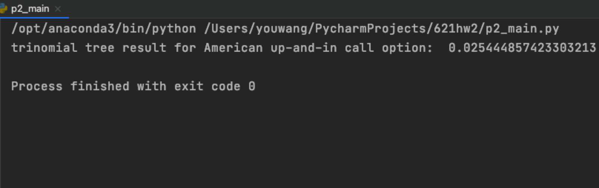

## Problem 3

We need to determine the range of possible strike prices for which early exercise is optimal. When early exercise is optimal, it means that expected American option premium is larger than expected European option premium. So to solve this problem, is to find the strike that makes American option premium larger than European option premium.

### (a)

We can write a simple program to find the strike:

```python
import numpy as np
from numpy import exp

u = 1.2
d = 0.9


def simple_tree(k):
    r = 0.04
    q = 0.02
    dt = 0.5 / 2
    discount = exp(-r * dt)
    pu = (exp((r - q) * dt) - d) / (u - d)
    pd = 1 - pu
    s0 = 40
    s1 = np.array([48, 36])
    s2 = np.array([57.6, 43.2, 32.4])
    # without early exercise
    payoff1 = np.maximum(s2 - k, 0)
    payoff1 = np.array([payoff1[0] * pu + payoff1[1] * pd,
                        payoff1[1] * pu + payoff1[2] * pd])
    payoff1 = payoff1 * discount
    payoff2 = np.maximum(payoff1, s1 - k)
    payoff1 = payoff1[0] * pu + payoff1[1] * pd
    payoff1 = discount * payoff1
    payoff2 = payoff2[0] * pu + payoff2[1] * pd
    payoff2 = discount * payoff2
    return payoff2-payoff1

n = np.arange(0, 48, 0.001)
diff1 = []
for i in n:
    diff1.append(simple_tree(i))
plt.plot(n, diff1, label='amer - euro')
plt.legend()
plt.show()
```

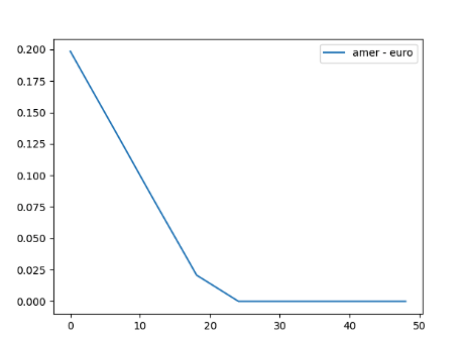

It reveals that when  strike prices is less than 24, early exercise is optimal.

### (b)

Do some change on the program before:

```python
def simple_tree2(k):
    r = 0.04
    q = 0
    dt = 0.5 / 2
    discount = exp(-r * dt)
    pu = (exp((r - q) * dt) - d) / (u - d)
    pd = 1 - pu
    s0 = 40
    s1 = np.array([46.56, 34.92])
    s2 = np.array([55.872, 41.904, 31.824])
    # without early exercise
    payoff1 = np.maximum(s2 - k, 0)
    payoff1 = np.array([payoff1[0] * pu + payoff1[1] * pd,
                        payoff1[1] * pu + payoff1[2] * pd])
    payoff1 = payoff1 * discount
    payoff2 = np.maximum(payoff1, s1 - k)
    payoff1 = payoff1[0] * pu + payoff1[1] * pd
    payoff1 = discount * payoff1
    payoff2 = payoff2[0] * pu + payoff2[1] * pd
    payoff2 = discount * payoff2
    return payoff2 - payoff1

n = np.arange(0, 48, 0.001)
diff2 = []
for i in n:
    diff2.append(simple_tree2(i))
plt.plot(n, diff2, label='amer - euro')
plt.legend()
plt.show()
```

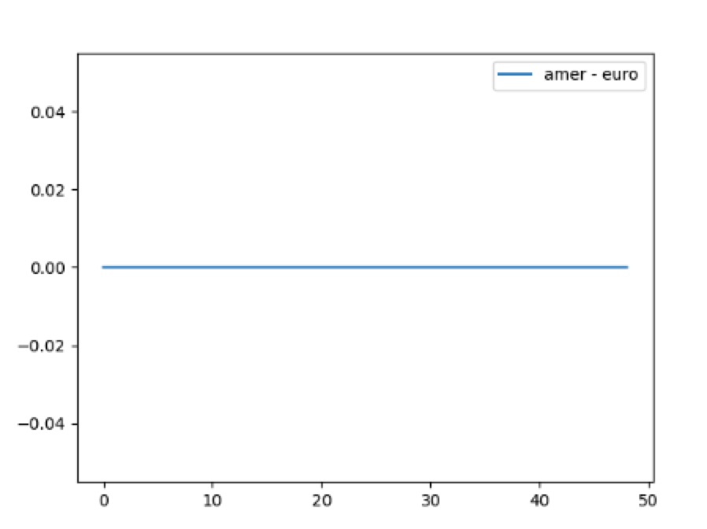

It reveals that the expected premium of American option is always the same with European option. That's to say, none of strike would satisfy that early exercise is optimal.

## Bonus Problem 2

By following the pseudo code in the paper:

```python 
import numpy as np

h1 = lambda x: np.ones(len(x))
h2 = lambda x: -2 * x
h3 = lambda x: x ** 2
f1 = lambda x: x ** 2
f2 = lambda x: x
f3 = lambda x: np.zeros(len(x))


def trinomial_tree_swap(S, K, T, r, sigma, N, l):
    # initialization
    t = T / N
    D = r - sigma ** 2 / 2
    delta_x = sigma * np.sqrt(3 * t)
    p_u = 0.5 * ((sigma ** 2 * t + D ** 2 * t ** 2) / delta_x ** 2 + D * t / delta_x)
    p_m = 1 - (sigma ** 2 * t + D ** 2 * t ** 2) / delta_x ** 2
    p_d = 0.5 * ((sigma ** 2 * t + D ** 2 * t ** 2) / delta_x ** 2 - D * t / delta_x)

    # construct stock price tree
    def tree_construction():
        s = [np.array([S])]
        for i in range(N * l):
            s_temp = np.exp(delta_x) * s[i]
            s_temp = np.append(s_temp, s[i][-1])
            s_temp = np.append(s_temp, s[i][-1] * np.exp(-delta_x))
            s.append(s_temp)
        return s

    s = tree_construction()

    for i in np.arange(N, -1, -1):
        for j in range(l):
            if i == N and j == 0:
                v = np.zeros(len(s[i * l]))
            elif i > 0 and j == 0:
                v = a * f1(s[i * l]) + b * f2(s[i * l]) + c + f3(s[i * l])
            elif i == 0:
                v = a * f1(s[i * l]) + b * f2(s[i * l]) + c + f3(s[i * l])
                return float(v) / N/l
            if (j == 0 and l > 1) or l == 1:
                temp = s[i * l - j]
                temp1 = np.roll(temp, -1)
                temp2 = np.roll(temp, -2)
                a = h1(temp) * p_u + h1(temp1) * p_m + h1(temp2) * p_d
                b = h2(temp) * p_u + h2(temp1) * p_m + h2(temp2) * p_d
                c = (h3(temp) + v) * p_u + (h3(temp1) + v) * p_m + (h3(temp2) + v) * p_d
                a = np.delete(a, -1)
                a = np.delete(a, -1)
                b = np.delete(b, -1)
                b = np.delete(b, -1)
                c = np.delete(c, -1)
                c = np.delete(c, -1)
            else:
                a1 = np.roll(a, -1)
                a2 = np.roll(a, -2)
                b1 = np.roll(b, -1)
                b2 = np.roll(b, -2)
                c1 = np.roll(c, -1)
                c2 = np.roll(c, -2)
                a = p_u * a + p_m * a1 + p_d * a2
                b = p_u * b + p_m * b1 + p_d * b2
                c = p_u * c + p_m * c1 + p_d * c2
                a = np.delete(a, -1)
                a = np.delete(a, -1)
                b = np.delete(b, -1)
                b = np.delete(b, -1)
                c = np.delete(c, -1)
                c = np.delete(c, -1)


S = 10
K = 10
r = 0.01
sigma = 0.2
T = 0.3
print(trinomial_tree_swap(S, K, T, r, sigma, 20, 3)*100 - K)
print(trinomial_tree_swap(S, K, T, r, sigma, 30, 2)*100 - K)

```

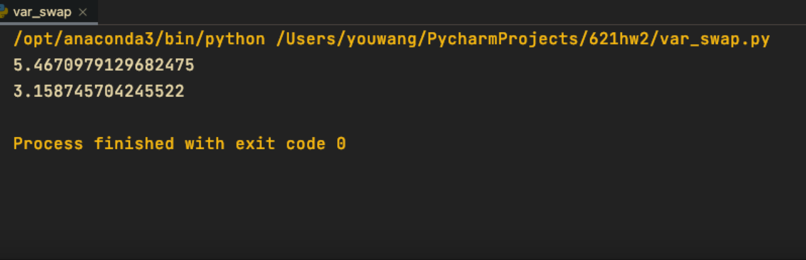


    pu = dt/2*((sigma/dx)**2 + nu/dx)
    pm = 1 - dt * (sigma/dx)**2 - r*dt
    pd = dt/2*((sigma/dx)**2 - nu/dx)