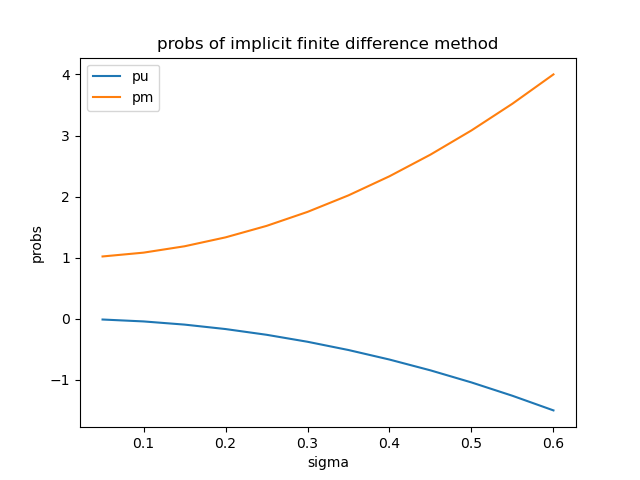

## Problem 1

### (a)

For the explicit method the final discretized equation is:

$$
-\frac{V_{i+1, j}-V_{i, j}}{\Delta t}=\nu \frac{V_{i+1, j+1}-V_{i+1, j-1}}{2 \Delta x}+\frac{1}{2} \sigma^{2} \frac{V_{i+1, j+1}-2 V_{i+1, j}+V_{i+1, j-1}}{\Delta x^{2}}-r V_{i+1, j}
$$

where $\nu = r - q - \frac{\sigma^2}{2}$

Rearrange the equation we get:

$$
\begin{aligned}
V_{i, j} &=p_{\mathrm{u}} V_{i+1 . j+1}+p_{\mathrm{m}} V_{i+1 . j}+p_{\mathrm{d}} V_{i+1, j-1} \\
p_{\mathrm{u}} &=\Delta t\left(\frac{\sigma^{2}}{2 \Delta x^{2}}+\frac{\nu}{2 \Delta x}\right) \\
p_{\mathrm{m}} &=1-\Delta t \frac{\sigma^{2}}{\Delta x^{2}}-r \Delta t \\
p_{\mathrm{d}} &=\Delta t\left(\frac{\sigma^{2}}{2 \Delta x^{2}}-\frac{\nu}{2 \Delta x}\right)
\end{aligned}
$$

At last, the boundary conditions:

$$
V_{N_j,j} = \begin{cases}
    V_{N_j-1, j+1} & for \ calls\\
    0 & for \ puts\\
\end{cases}
$$

$$
V_{-N_j,j} = \begin{cases}
    0 & for \ calls\\
    V_{-N_j+1, j+1} & for \ puts\\
\end{cases}
$$

Then we can implement explicit method in our program:

1. First of all, we define a `payoff` function to calculate payoffs:

    ```python
    def payoff(op_type, s, k):
        if op_type == 'c':
            return np.maximum(s - k, 0)
        elif op_type == 'p':
            return np.maximum(k - s, 0)
        else:
            raise ValueError("undefined option type")
    ```

2. Next define the explicit function as `e_fdm`:

    - In the function, we first precomputes constants $\Delta t, \nu, p_u, p_m, p_d$.

    - Then use `np.arange` to generate a list from $N_j$ to $-N_j$ with step 1:
  
    $$l = (N_j, N_j-1 \cdots, 0, \cdots -N_j+1, -N_j)$$

    $$S_t= S_0  e^{l \cdot \Delta x}$$

    - Next we define a `backward` function to do backward calculation, and here use `np.roll` to do vectorized calculation instead of looping; Besides in the function we apply the boundary and early exercise (if it's an American option) condition.

    

    - At last of `e_fdm` function, do `backward` for $N$ times and return the result.

Codes is in the following block:

```python
def e_fdm(S, K, T, r, sigma, q, N, Nj, dx, op_type, style):
# precompute
dt = T / N
nu = r - q - sigma ** 2 / 2
pu = 0.5 * dt * ((sigma / dx) ** 2 + nu / dx)
pm = 1 - dt * (sigma / dx) ** 2 - r * dt
pd = 0.5 * dt * ((sigma / dx) ** 2 - nu / dx)

# stock price and payoff at maturity
st = np.arange(Nj, -Nj - 1, -1)
st = np.exp(st * dx) * S
p = payoff(op_type, st, K)

def backward(p):
    temp1 = np.roll(p, -1)
    temp2 = np.roll(p, -2)
    temp3 = p * pu + temp1 * pm + temp2 * pd
    p[1:-1] = temp3[0:-2]
    if op_type == 'c':
        p[0] = p[1] + (st[0] - st[1])
        p[-1] = p[-2]
    elif op_type == 'p':
        p[0] = p[1]
        p[-1] = p[-2] + (st[-2] - st[-1])
    if style == 'a':
        p = np.maximum(p, payoff(op_type, st, K))

for i in range(N):
    backward(p)

return p[N]

```

### (b)

$$
-\frac{V_{i+1, j}-V_{i, j}}{\Delta t}=\frac{1}{2} \sigma^{2} \frac{V_{i, j+1}-2 V_{i, j}+V_{i, j-1}}{\Delta x^{2}}+\nu \frac{V_{i, j+1}-V_{i, j-1}}{2 \Delta x}-r V_{i, j}
$$

It can be written as:

$$
\begin{aligned}
V_{i+1, i} &=p_{\mathrm{u}} V_{i, i+1}+p_{\mathrm{m}} V_{i, j}+p_{\mathrm{d}} V_{i, i-1} \\
p_{\mathrm{u}}&=-\frac{1}{2} \Delta t\left(\frac{\sigma^{2}}{\Delta x^{2}}+\frac{\nu}{\Delta x}\right) \\
p_{\mathrm{m}}&=1+\Delta t \frac{\sigma^{2}}{\Delta x^{2}}+r \Delta t \\
p_{d}&=-\frac{1}{2} \Delta t\left(\frac{\sigma^{2}}{\Delta x^{2}}-\frac{\nu}{\Delta x}\right)
\end{aligned}
$$

The boundary conditions are the same as we talked before in Problem [a](#a).

So it can be expressed in the matrix form: $Ax=b$

$$
\left[\begin{array}{ccccccc}
1 & -1 & 0 & 0 & 0 & \ldots & 0 \\
p_u &p_m & p_d & 0 & 0 & \ldots & 0 \\
0 & p_u &p_m & p_d & 0 & \ldots & 0 \\
\vdots & \ddots & \ddots & \ddots & \ddots & \ddots & \vdots \\
0 & 0 & \ddots & \ddots & p_m & p_d & 0 \\
0 & 0 & 0 & \ddots & p_u &p_m & p_d \\
0 & 0 & 0 & \ldots & 0 & 1 & -1
\end{array}\right]\left[\begin{array}{c}
V_{i, N_{j}} \\
V_{i, N_{j}-1} \\
V_{i, N_{j}-2} \\
\vdots \\
\vdots \\
V_{i,-N_{j}+1} \\
V_{i,-N_{j}}
\end{array}\right]=\left[\begin{array}{c}
\lambda_{U} \\
V_{i+1, N_{j}-1} \\
V_{i+1, N_{j}-2} \\
\vdots \\
\vdots \\
V_{i+1,-N_{j}+1} \\
\lambda_{L}
\end{array}\right]
$$

To implement it in python:

1. First precomputes constants.
2. Then use `numpy` functions to construct matrix $A$.
3. Next calculate $\lambda_U$, $\lambda_L$.
4. In the `backward` function, we substitute the first and last element of payoff array with $\lambda_U$ and $\lambda_L$. Then use `np.solve` to solve the equation $Ax=b$.
5. Do `backward` for $N$ times.

```python
def i_fdm(S, K, T, r, sigma, q, N, Nj, dx, op_type, style):
    # precompute constants
    dt = T / N
    nu = r - q - sigma ** 2 / 2
    pu = - 0.5 * dt * ((sigma / dx) ** 2 + nu / dx)
    pm = 1 + dt * (sigma / dx) ** 2 + r * dt
    pd = - 0.5 * dt * ((sigma / dx) ** 2 - nu / dx)

    # construct tridiagnal matrix
    l1 = np.zeros((1, 2 * Nj + 1))
    l2 = np.zeros((1, 2 * Nj + 1))
    l1[0][0] = 1
    l1[0][1] = -1
    l2[0][-1] = -1
    l2[0][-2] = 1
    rows = 2 * Nj - 1
    cols = 2 * Nj + 1
    a = np.eye(rows, cols, 0) * pu \
        + np.eye(rows, cols, 1) * pm \
        + np.eye(rows, cols, 2) * pd
    a = np.r_[l1, a, l2]

    # stock price and payoff at maturity
    st = np.arange(Nj, -Nj - 1, -1)
    st = np.exp(st * dx) * S
    p = payoff(op_type, st, K)

    # lambda
    if op_type == 'c':
        lambda_u = st[0] - st[1]
        lambda_l = 0
    elif op_type == 'p':
        lambda_u = 0
        lambda_l = st[-2] - st[-1]

    # backward calculation
    def backward(p):
        b = np.append(lambda_u, p[1:-1])
        b = np.append(b, lambda_l)
        x = np.linalg.solve(a, b)
        print(x.shape)
        return x

    for i in range(N):
        p = backward(p)

    return p[N]

```

### (c)

The Crank-Nicolson finite different method averages the space derivatives at $i$ and $i+1$:

$$
\begin{array}{l}
-\frac{V_{i+1, j}-V_{i, j}}{\Delta t} \\
=\frac{1}{2} \sigma^{2}\left(\frac{\left(V_{i+1, j+1}-2 V_{i+1, j}+V_{i+1, j-1}\right)+\left(V_{i, j+1}-2 V_{i, j}+V_{i, j-1}\right)}{2 \Delta x^{2}}\right) \\
\quad+\nu \left(\frac{\left(V_{i+1, j+1}-V_{i+1, j-1}\right)+\left(V_{l, j+1}-V_{i, j-1}\right)}{4 \Delta x}\right)-r\left(\frac{V_{i+1, j}+V_{i, j}}{2}\right)
\end{array}
$$

Which can be rewritten as:

$$
\begin{aligned}
p_{\mathrm{u}} V_{i, j+1}+p_{\mathrm{m}} V_{i, j}+p_{\mathrm{d}} V_{i, j-1} &=-p_{\mathrm{n}} V_{i+1, j+1}-\left(p_{\mathrm{m}}-2\right) V_{i+1, j}-p_{\mathrm{d}} V_{i+1, j-1} \\
p_{\mathrm{u}} &=-\frac{1}{4} \Delta t\left(\frac{\sigma^{2}}{\Delta x^{2}}+\frac{\nu}{\Delta x}\right) \\
p_{\mathrm{m}} &=1+\Delta t \frac{\sigma^{2}}{2 \Delta x^{2}}+\frac{r \Delta t}{2} \\
p_{\mathrm{d}} &=-\frac{1}{4} \Delta t\left(\frac{\sigma^{2}}{\Delta x^{2}}-\frac{\nu}{\Delta x}\right)
\end{aligned}
$$

So to implement it in python, the only difference is the $p_u$, $p_m$ $p_d$ and the matrix $A$:

```python
def cn_fdm(S, K, T, r, sigma, q, N, Nj, dx, op_type, style):
    # precompute constants
    dt = T / N
    nu = r - q - sigma ** 2 / 2
    pu = - 0.25 * dt * ((sigma / dx) ** 2 + nu / dx)
    pm = 1 + 0.5 * dt * (sigma / dx) ** 2 + 0.5 * r * dt
    pd = - 0.25 * dt * ((sigma / dx) ** 2 - nu / dx)

    # construct tridiagnal matrix
    l1 = np.zeros((1, 2 * Nj + 1))
    l2 = np.zeros((1, 2 * Nj + 1))
    l1[0][0] = 1
    l1[0][1] = -1
    l2[0][-1] = -1
    l2[0][-2] = 1
    rows = 2 * Nj - 1
    cols = 2 * Nj + 1
    a = np.eye(rows, cols, 0) * pu \
        + np.eye(rows, cols, 1) * pm \
        + np.eye(rows, cols, 2) * pd
    a = np.r_[l1, a, l2]

    # stock price and payoff at maturity
    st = np.arange(Nj, -Nj - 1, -1)
    st = np.exp(st * dx) * S
    p = payoff(op_type, st, K)

    # lambda
    if op_type == 'c':
        lambda_u = st[0] - st[1]
        lambda_l = 0
    elif op_type == 'p':
        lambda_u = 0
        lambda_l = st[-2] - st[-1]

    # backward calculation
    def backward(p):
        temp1 = np.roll(p, -1)
        temp2 = np.roll(p, -2)
        temp3 = -p * pu - temp1 * (pm-2) - temp2 * pd
        p[1:-1] = temp3[0:-2]
        b = np.append(lambda_u, p[1:-1])
        b = np.append(b, lambda_l)
        x = np.linalg.solve(a, b)
        return x

    for i in range(N):
        p = backward(p)

    return p[N]

```

### (d)

The order of convergence for explicit algorithm and implicit algorithm are both $O(\Delta x^2 + \Delta t)$, and we know that the best choice for $\Delta x = \sigma \sqrt{3 \Delta t}$. Besides, if the process follows the usual geometric Brownian motion, then one needs to cover at least the range $(-3\sigma \sqrt{T}, 3\sigma \sqrt{T})$ which is the range containing 99.7% of the possible values for the return.

To estimate $\Delta t, \Delta x$, we approximate that:

$$
\begin{cases}
    \Delta x^2 + \Delta t = \epsilon \\
    \Delta x = \sigma \sqrt{3 \Delta t}
\end{cases}
$$

Solve it we can get:

$$
\begin{aligned}
    \Delta t &= \frac{\epsilon}{3 \sigma^2 + 1} \\
    \Delta x &=\sigma \sqrt{\frac{3 \epsilon}{3 \sigma^2 + 1}} \\
\end{aligned}
$$

For $N$ and $N_j$:

$$
\begin{aligned}
    N &= \frac{T}{\Delta t} = \frac{3 \sigma^2 + 1}{\epsilon} \cdot T \\
N_j &=  0.5 \cdot (\frac{6 \sigma \sqrt{T}}{\Delta x} - 1) = \sqrt{3N} - 0.5
\end{aligned}
$$

### (e)

Use the result we calculated in [d](#d):

```python
import numpy as np
import matplotlib.pyplot as plt
from finite_diff_methods import *

# params
S = 100
K = 100
T = 1
sigma = 0.2
r = 0.06
q = 0.02

epsilon = 0.0001
dt = epsilon / (3 * sigma ** 2 + 1)
dx = sigma * np.sqrt(3 * dt)
N = int(np.ceil(T / dt))
Nj = int(np.ceil((2 * np.sqrt(3 * N) - 1) / 2))

# part e
print("result of part e:")
print("dt: ", dt)
print("dx: ", dx)
print("N: ", N)
print("Nj: ", Nj)

ec = e_fdm(S, K, T, r, sigma, q, N, Nj, dx, 'c', 'e')
ep = e_fdm(S, K, T, r, sigma, q, N, Nj, dx, 'p', 'e')
print("call of explicit method is: {0}, "
      "put of explicit method is: {1}".format(ec, ep))
ic = i_fdm(S, K, T, r, sigma, q, N, Nj, dx, 'c', 'e')
ip = i_fdm(S, K, T, r, sigma, q, N, Nj, dx, 'p', 'e')
print("call of implicit method is: {0}, "
      "put of implicit method is: {1}".format(ic, ip))
cc = cn_fdm(S, K, T, r, sigma, q, N, Nj, dx, 'c', 'e')
cp = cn_fdm(S, K, T, r, sigma, q, N, Nj, dx, 'p', 'e')
print("call of Crank-Nicolson method is: {0}, "
      "put of Crank-Nicolson method is: {1}".format(cc, cp))
```


From the pic we know, result of numbers in part [d](#d):

|  $\Delta t$   | $\Delta x$  | $N$ | $N_j$ |
|  ----  | ----  | --- | --- |
| $8.9286\cdot10^{-5}$ | 0.003273 | 11200 | 183|

Options' prices using 3 methods: (It's also the result of part [h](#h))

|type| explicit | implicit | Crank-Nicolson|
| --- | --- | --- | --- |
|call| 9.7285| 9.7283| 9.7284|
|put| 5.8850| 5.8848| 8.8849|

### (f)

First define the `BS_formula` function:

```python
def BS_formula(Type, S, K, T, sigma, r):
    d1 = (np.log(S / K) + (r + sigma ** 2 / 2) * T) / (sigma * np.sqrt(T))
    d2 = d1 - sigma * np.sqrt(T)
    if Type == 'c':
        return norm.cdf(d1) * S - norm.cdf(d2) * K * np.exp(-r * T)
    elif Type == 'p':
        return K * np.exp(-r * T) * norm.cdf(-d2) - norm.cdf(-d1) * S
    else:
        raise TypeError("Type must be 'c' for call, 'p' for put")
```

Next define `get_iter` function to get the number of iterations:

```python
def get_iter(S, K, T, r, sigma, q, op_type, method):
    N = 50
    dt = T / N
    dx = sigma * np.sqrt(3 * dt)
    Nj = int(np.ceil((2 * np.sqrt(3 * N) - 1) / 2))
    fd_price = method(S, K, T, r, sigma, q, N, Nj, dx, op_type, 'e')
    bs_price = BS_formula(op_type, S, K, T, sigma, r, q)
    iter = 0
    while abs(fd_price - bs_price) > epsilon:
        N += 100
        dt = T / N
        dx = sigma * np.sqrt(3 * dt)
        Nj = int(np.ceil((2 * np.sqrt(3 * N) - 1) / 2))
        fd_price = method(S, K, T, r, sigma, q, N, Nj, dx, op_type, 'e')
        bs_price = BS_formula(op_type, S, K, T, sigma, r, q)
        iter += 1
    return iter
```

At last we use the function above:

```python
esc = get_iter(S, K, T, r, sigma, q, 'c', e_fdm)
esp = get_iter(S, K, T, r, sigma, q, 'p', e_fdm)
print("step1 of explicit method is: {0}, "
      "step2 of explicit method is: {1}".format(esc, esp))
isc = get_iter(S, K, T, r, sigma, q, 'c', i_fdm)
isp = get_iter(S, K, T, r, sigma, q, 'p', i_fdm)
print("step1 of explicit method is: {0}, "
      "step2 of explicit method is: {1}".format(isc, isp))
csc = get_iter(S, K, T, r, sigma, q, 'c', cn_fdm)
csp = get_iter(S, K, T, r, sigma, q, 'p', cn_fdm)
print("step1 of Crank-Nicolson method is: {0}, "
      "step2 of Crank-Nicolson method is: {1}".format(csc, csp))
```

Result:


|method |call | put|
|---  | ---| ---|
|EFD | 76 | 154|
|IFD| 193 | 321|
|CNFD| 139 | 237|

From the table we can find implicit finite difference method takes the most iterations and explicit finite difference method uses the least iterations; Additionally, all three methods takes more iterations to get put price with error less than epsilon we choose.

### (g)

Use a `prob` function to calculate probs:

```python
def prob(T, r, sigma, q, N, dx):
    dt = T / N
    nu = r - q - sigma ** 2 / 2
    pu = - 0.5 * dt * ((sigma / dx) ** 2 + nu / dx)
    pm = 1 + dt * (sigma / dx) ** 2 + r * dt
    pd = - 0.5 * dt * ((sigma / dx) ** 2 - nu / dx)
    return pu, pm, pd


sig = np.arange(0.05, 0.61, 0.05)
pu, pm, pd = prob(T, r, sig, q, N, dx)
plt.figure(1)
plt.xlabel("sigma")
plt.ylabel("probs")
plt.title("probs of implicit finite difference method")
plt.plot(sig, pu, label = 'pu')
plt.plot(sig, pm, label = 'pm')
plt.plot(sig, pd, label = 'pd')
plt.legend()
plt.show()
```


Note here $p_u$ and $p_d$ are very close to each other, so it looks like that $p_u$ doesn't show in the plot. We can only plot $p_u$ and $p_m$ to find that:



Comment:

Because here we use the same parameters in part [e](#e), so we know $\Delta x$ is very small. And by taking a look at $p_u$, $p_m$, $p_d$:

$$
\begin{aligned}
p_{\mathrm{u}}&=-\frac{1}{2} \Delta t\left(\frac{\sigma^{2}}{\Delta x^{2}}+\frac{\nu}{\Delta x}\right) \\
p_{\mathrm{m}}&=1+\Delta t \frac{\sigma^{2}}{\Delta x^{2}}+r \Delta t \\
p_{d}&=-\frac{1}{2} \Delta t\left(\frac{\sigma^{2}}{\Delta x^{2}}-\frac{\nu}{\Delta x}\right)
\end{aligned}
$$

- Obviously when $\Delta x$ is very small, $\frac{\sigma^{2}}{\Delta x^{2}}$ is much more larger than $\frac{\nu}{\Delta x}$. As a result, $p_u$ and $p_d$ are approximately equal to $-\frac{1}{2} \Delta t \cdot \frac{\sigma^{2}}{\Delta x^{2}}$.
- When $\sigma$ is larger, $p_u$ and $p_d$ becomes less, and $p_m$ becomes larger.

### (h)

The following is the table of results calculated by 3 methods: (It has been calculated in part [e](#e))

|type| EFD | IFD | CNFD|
| --- | --- | --- | --- |
|call| 9.7285| 9.7283| 9.7284|
|put| 5.8850| 5.8848| 8.8849|

We can find that the result of Crank-Nicolson is just the average of explicit and implicit methods' results.

### (i)

For delta, gamma and theta, we can use the girds to calculate them directly:

```python
def delta_gamma_theta(S, K, T, r, sigma, q, N, Nj, dx, op_type):
    # precompute
    dt = T / N
    nu = r - q - sigma ** 2 / 2
    pu = 0.5 * dt * ((sigma / dx) ** 2 + nu / dx)
    pm = 1 - dt * (sigma / dx) ** 2 - r * dt
    pd = 0.5 * dt * ((sigma / dx) ** 2 - nu / dx)

    # stock price and payoff at maturity
    st = np.arange(Nj, -Nj - 1, -1)
    st = np.exp(st * dx) * S
    p = payoff(op_type, st, K)

    def backward(p):
        temp1 = np.roll(p, -1)
        temp2 = np.roll(p, -2)
        temp3 = p * pu + temp1 * pm + temp2 * pd
        p[1:-1] = temp3[0:-2]
        if op_type == 'c':
            p[0] = p[1] + (st[0] - st[1])
            p[-1] = p[-2]
        elif op_type == 'p':
            p[0] = p[1]
            p[-1] = p[-2] + (st[-2] - st[-1])

    for i in range(N):
        if i == N-1:
            p1 = p[Nj]
        backward(p)

    delta = (p[Nj+1] - p[Nj-1]) / (st[Nj+1] - st[Nj-1])
    delta1 = (p[Nj+1] - p[Nj]) / (st[Nj+1] - st[Nj])
    delta2 = (p[Nj] - p[Nj-1]) / (st[Nj] - st[Nj-1])
    gamma = (delta1 - delta2) / (0.5 * (st[Nj+1] - st[Nj-1]))
    theta = (p1 - p[Nj])/dt
    return delta, gamma, theta
```

For vega, we need to apply small changes on $\sigma$, then use the difference of prices divided by small changes:

```python
def vega(S, K, T, r, sigma, q, N, Nj, dx, op_type):
    p1 = e_fdm(S, K, T, r, sigma, q, N, Nj, dx, op_type, 'e')
    p2 = e_fdm(S, K, T, r, sigma+0.05, q, N, Nj, dx, op_type, 'e')
    return (p2-p1)/0.05
```

Use the same parameter in part [e](#e) to calculate Greeks of call option:

```python
# part i
delta, gamma, theta = delta_gamma_theta(
    S, K, T, r, sigma, q, N, Nj, dx, 'c')
vega = vega(S, K, T, r, sigma, q, N, Nj, dx, 'c')

print("delta: ", delta)
print("gamma: ", gamma)
print("vega: ", vega)
print("theta: ", theta)

```


## Problem 2

### (a)

1. download data, save the data to a binary file.

    ```python
    import pandas as pd
    import numpy as np
    import yfinance as yf
    from implied_vol import *
    from finite_diff_methods import *

    # download
    spy = yf.Ticker("SPY")
    equity_data = yf.download(tickers='SPY',period='1d')
    expiry = ['2021-04-16', '2021-05-21', '2021-06-18']
    call = []
    put = []
    for date in expiry:
        call.append(spy.option_chain(date)[0])
        put.append(spy.option_chain(date)[1])

    # save
    pd.to_pickle(call, "./datasets/call.pkl")
    pd.to_pickle(put, "./datasets/put.pkl")
    pd.to_pickle(equity_data, "./datasets/equity.pkl")

    ```

2. Read data and choose options with strike from 385 to 395.

    ```python
    call = pd.read_pickle("./datasets/call.pkl")
    put = pd.read_pickle("./datasets/put.pkl")
    equity_data = pd.read_pickle("./datasets/equity.pkl")
    expiry = ['2021-04-16', '2021-05-21', '2021-06-18']

    # clean
    def clean(data):
        new_data = []
        for df,date in zip(data, expiry):
            df['expiry'] = pd.to_datetime(date)
            df['t2m'] = (df['expiry'] - pd.Timestamp('today')) / np.timedelta64(1, 'Y')
            df['s0'] = equity_data.iloc[0,3]
            df['market_price'] = df.bid/2 + df.ask/2
            # choose strike between 385 to 395
            new_df = df.loc[df.strike.isin(np.arange(385,395))].reset_index()
            del new_df['index']
            new_data.append(new_df)
        return new_data
    call = clean(call)
    put = clean(put)
    ```

3. Use bisection method to calculate implied volatility. (codes of `get_impliedVol` are pasted from Homework 1. I have put it in the appendix, you can find it [here](#appendix))

   ```python
    # get vol
    r = 0.07/100
    for df in call:
        df['vol'] = df.apply(lambda x: \
                                get_impliedVol('c', x.s0, x.strike, x.t2m, r, x.price),axis=1)

    for df in put:
        df['vol'] = df.apply(lambda x: \
                                get_impliedVol('c', x.s0, x.strike, x.t2m, r, x.price),axis=1)
   ```

### (b)

- Define a `fd_price` function, so that it can be applied on DataFrames in pandas:
  
    ```python
    def fd_price(x, epsilon, method):
    dt = epsilon / (3 * x.vol ** 2 + 1)
    dx = x.vol * np.sqrt(3 * dt)
    N = int(np.ceil(x.t2m / dt))
    Nj = int(np.ceil((2 * np.sqrt(3 * N) - 1) / 2))
    return method(x.s0, x.strike, x.t2m, r, x.vol, 0, N, Nj, dx, x.type, 'e')
    ```

- Apply the function:

    ```python
        for df1,df2 in zip(call, put):
    df1['EFD'] = df1.apply(lambda x: 
                           fd_price(x, epsilon, e_fdm),axis=1)
    df1['IFD'] = df1.apply(lambda x:
                           fd_price(x, epsilon, i_fdm),axis=1)
    df1['CNFD'] = df1.apply(lambda x:
                            fd_price(x, epsilon, cn_fdm),axis=1)
    df2['EFD'] = df2.apply(lambda x:
                           fd_price(x, epsilon, e_fdm),axis=1)
    df2['IFD'] = df2.apply(lambda x:
                           fd_price(x, epsilon, i_fdm),axis=1)
    df2['CNFD'] = df2.apply(lambda x:
                            fd_price(x, epsilon, cn_fdm),axis=1)
    ```

    Results are presented in the table of part d. You can see it [here](#tables).

### (c)

The idea of part c is similar with part b:

```python
def get_greeks(x):
    dt = epsilon / (3 * x.vol ** 2 + 1)
    dx = x.vol * np.sqrt(3 * dt)
    N = int(np.ceil(x.t2m / dt))
    Nj = int(np.ceil((2 * np.sqrt(3 * N) - 1) / 2))
    delta,gamma = delta_gamma(x.s0, x.strike, x.t2m, r, x.vol, 0, N, Nj, dx, x.type)
    vega_ = vega(x.s0, x.strike, x.t2m, r, x.vol, 0, N, Nj, dx, x.type)
    theta_ = theta(x.s0, x.strike, x.t2m, r, x.vol, 0, N, Nj, dx, x.type)
    return delta, gamma, vega_, theta_


for df1,df2 in zip(call, put):
    df1[['delta', 'gamma', 'vega', 'theta']] = \
    df1.apply(get_greeks,axis=1, result_type="expand")
    df2[['delta', 'gamma', 'vega', 'theta']] = \
    df2.apply(get_greeks,axis=1, result_type="expand")
```

Table of options' greeks maturing at 2021-04-16:

Call:

|strike|market_price|vol   |delta |gamma |theta   |vega   |
|------|------------|------|------|------|--------|-------|
|385.0 |10.985      |0.1943|0.6281|0.0193|-56.3207|38.2343|
|386.0 |10.18       |0.189 |0.6109|0.0202|-55.6071|38.7135|
|387.0 |9.525       |0.1871|0.5914|0.0207|-55.9917|39.2471|
|388.0 |8.725       |0.1811|0.572 |0.0216|-54.5618|39.4786|
|389.0 |8.165       |0.1806|0.5503|0.0218|-54.8126|39.7086|
|390.0 |7.495       |0.1769|0.5286|0.0224|-54.0501|39.9371|
|391.0 |6.825       |0.1726|0.506 |0.0231|-53.0269|40.1168|
|392.0 |6.205       |0.169 |0.4824|0.0235|-51.6725|39.9814|
|393.0 |5.695       |0.1676|0.4586|0.0235|-50.9794|39.8435|
|394.0 |5.17        |0.1652|0.4339|0.0238|-49.979 |39.7008|

Put:

|strike|market_price|vol   |delta  |gamma |theta   |vega   |
|------|------------|------|-------|------|--------|-------|
|394.0 |8.07        |0.1593|-0.5691|0.0246|-47.8872|39.6828|
|393.0 |7.54        |0.1604|-0.544 |0.0246|-48.4817|39.8297|
|392.0 |7.11        |0.1633|-0.5188|0.0243|-49.6521|39.9765|
|391.0 |6.735       |0.1671|-0.4944|0.0238|-51.0491|40.1164|
|390.0 |6.365       |0.1703|-0.471 |0.0233|-51.7628|39.9324|
|389.0 |5.985       |0.1728|-0.4483|0.0228|-52.13  |39.6961|
|388.0 |5.68        |0.1766|-0.4266|0.0221|-52.9115|39.4676|
|387.0 |5.375       |0.1799|-0.4058|0.0215|-53.4248|39.1789|
|386.0 |5.175       |0.1854|-0.3874|0.0206|-54.2052|38.6722|
|385.0 |4.835       |0.1869|-0.3677|0.02  |-53.6883|38.1335|

### (d)

First , save data to csv files:

```python
# save to csv
for df1,df2 in zip(call, put):
    path1 = './p2_csv/' + df1.iloc[0,0][0:10] + '.csv'
    path2 = './p2_csv/' + df2.iloc[0,0][0:10] + '.csv'
    df1.to_csv(path1, index=False)
    df2.to_csv(path2, index=False)
```

Choose options maturing at 2021-05-21 to create the table: (other data can be found under *./codes/p2_csv/*)

```python
info = ['t2m', 'strike', 'type', 'ask', 'bid',
       'market_price', 'vol', 'EFD', 'IFD', 'CNFD']
data1 = call[1][info].round(4)
data2 = put[1][info].round(4)
data1.to_csv('./p2_csv/d_res1.csv', index=False)
data2.to_csv('./p2_csv/d_res2.csv', index=False)
```

### Tables

Call option table:

|t2m   |strike|type|ask |bid  |market_price|vol   |EFD    |IFD    |CNFD   |
|------|------|----|----|-----|------------|------|-------|-------|-------|
|0.1706|395.0 |c   |9.12|9.08 |9.1         |0.1704|9.1024 |9.0952 |9.0988 |
|0.1706|397.0 |c   |7.98|7.94 |7.96        |0.1654|7.9634 |7.9567 |7.9601 |
|0.1706|435.0 |c   |0.4 |0.38 |0.39        |0.1467|0.3908 |0.3939 |0.3923 |
|0.1706|400.0 |c   |6.58|6.54 |6.56        |0.161 |6.5584 |6.5525 |6.5554 |
|0.1706|424.0 |c   |0.99|0.97 |0.98        |0.1449|0.9781 |0.9804 |0.9792 |
|0.1706|390.0 |c   |12.0|11.96|11.98       |0.1792|11.9824|11.9747|11.9786|
|0.1706|396.0 |c   |8.56|8.52 |8.54        |0.1682|8.5364 |8.5294 |8.5329 |
|0.1706|430.0 |c   |0.6 |0.58 |0.59        |0.1454|0.591  |0.5939 |0.5925 |
|0.1706|405.0 |c   |4.56|4.52 |4.54        |0.1534|4.5395 |4.5355 |4.5375 |
|0.1706|404.0 |c   |4.91|4.87 |4.89        |0.1546|4.8912 |4.8868 |4.889  |

Put option table:

|t2m   |strike|type|ask  |bid  |market_price|vol   |EFD    |IFD   |CNFD   |
|------|------|----|-----|-----|------------|------|-------|------|-------|
|0.1706|371.0 |p   |5.98 |5.94 |5.96        |0.2178|5.9633 |5.9583|5.9608 |
|0.1706|377.0 |p   |7.2  |7.16 |7.18        |0.2049|7.1791 |7.1728|7.1759 |
|0.1706|385.0 |p   |9.2  |9.17 |9.185       |0.1862|9.1846 |9.1771|9.1808 |
|0.1706|349.0 |p   |3.18 |3.16 |3.17        |0.2658|3.1676 |3.1679|3.1678 |
|0.1706|390.0 |p   |10.89|10.85|10.87       |0.1759|10.8726|10.865|10.8688|
|0.1706|380.0 |p   |7.88 |7.86 |7.87        |0.198 |7.8671 |7.8603|7.8637 |
|0.1706|384.0 |p   |8.87 |8.84 |8.855       |0.1878|8.8587 |8.8513|8.855  |
|0.1706|350.0 |p   |3.27 |3.24 |3.255       |0.2635|3.2527 |3.2528|3.2528 |
|0.1706|345.0 |p   |2.85 |2.82 |2.835       |0.2742|2.8299 |2.831 |2.8304 |
|0.1706|375.0 |p   |6.76 |6.73 |6.745       |0.2093|6.7486 |6.7427|6.7457 |

Choose call options maturing at 05-21 and 06-21 to plot:


From the table and plot, we find that $A, B, C_M$ and prices calculated by finite difference are very close. And the upper lines are the prices of options maturing at 06-21 since their time to maturity is longer.

## Problem 3

### 1

First we need to transform stock price process to return process: $x = \log S$ and choose $V(S,t) = V(e^x,t) = U(x,t)$. By applying chain rule, we have:

$$
\frac{\partial U}{\partial x}=\frac{\partial V}{\partial x}=\frac{\partial V}{\partial S} \cdot \frac{\partial S}{\partial x}=\frac{\partial V}{\partial S} \cdot e^{x}=\frac{\partial V}{\partial S} \cdot S
$$

and

$$
\begin{aligned}
\frac{\partial^{2} U}{\partial x^{2}} &=\frac{\partial}{\partial x}\left(\frac{\partial U}{\partial x}\right) \\
&=\frac{\partial}{\partial x}\left(\frac{\partial V}{\partial S} \cdot \frac{\partial S}{\partial x}\right) \\
&=\frac{\partial^{2} V}{\partial S^{2}} \cdot \frac{\partial S}{\partial x} \cdot \frac{\partial S}{\partial x}+\frac{\partial V}{\partial S} \cdot \frac{\partial^{2} S}{\partial x^{2}}
\end{aligned}
$$

Thus

$$
\frac{\partial^{2} U}{\partial x^{2}}=\frac{\partial^{2} V}{\partial S^{2}} S^{2}+\frac{\partial V}{\partial S} \cdot = \frac{\partial^{2} V}{\partial S^{2}} S^{2} + \frac{\partial V}{\partial x}
$$

Therefore the PDE in this question becomes:

$$
\frac{\partial V}{\partial t}+\frac{2 \cos (S)}{S} \frac{\partial V}{\partial x}+0.2 S^{-\frac{1}{2}}\left(\frac{\partial^{2} V}{\partial x^{2}}-\frac{\partial V}{\partial x}\right)-r V=0
$$

$$
\frac{\partial V}{\partial t}+\left(\frac{2 \cos (S)}{S} - 0.2 S^{-\frac{1}{2}} \right) \frac{\partial V}{\partial x}+0.2 S^{-\frac{1}{2}}\frac{\partial^{2} V}{\partial x^{2}}-r V=0
$$

Use forward difference to discretize the derivatives the equation:

$$
\frac{V_{i+1,j}-V_{i, j}}{\Delta t}+a_{i,j} \frac{V_{i+1, j+1}-V_{i+1, j-1}}{2 \Delta x}+b_{i,j} \frac{V_{i+1, j+1}-2 V_{i, j}+V_{i+1, j-1}}{\Delta x^{2}}-r V_{i+1, j}=0
$$

where $a_{i,j} = \frac{2 \cos (S_{i,j})}{S_{i,j}} - 0.2 S_{i,j}^{-\frac{1}{2}}$, $b_{i,j} = 0.2 S_{i,j}^{-\frac{1}{2}}$.

Rearrange the function:

$$
\begin{aligned}
V_{i, j} &=p_{u} V_{i+1 . j+1}+p_{m} V_{i+1, j}+p_{d} V_{i+1, j-1} \\
p_{u} &=\Delta t\left(\frac{b_{i,j}}{\Delta x^{2}}+\frac{a_{i,j}}{2 \Delta x}\right) \\
p_{m} &=1-\Delta t \frac{2b_{i,j}}{\Delta x^{2}}-r \Delta t \\
p_{d} &=\Delta t\left(\frac{b_{i,j}}{\Delta x^{2}}-\frac{a_{i,j}}{2 \Delta x}\right)
\end{aligned}
$$

### 2

For call option we need boundary conditions:

- When $S \rightarrow \infty$: $\frac{\partial V}{\partial S}=1$
- When $S \rightarrow 0_+$: $\frac{\partial V}{\partial S}=0$

### 3

From $-N_j$ to $N_j$ we have different $pu, pm, pd$ for different stock prices, but for girds at each time point, their $pu, pm, pd$ are the same correspondingly. i.e. Prob of $(i,j)$ are the same with $(i+1,j)$ for any $j$.

## Appendix

Codes used to calculate implied vols:

```python
import numpy as np
from scipy.stats import norm


def BS_formula(Type, S, K, T, sigma, r):
    d1 = (np.log(S / K) + (r + sigma ** 2 / 2) * T) / (sigma * np.sqrt(T))
    d2 = d1 - sigma * np.sqrt(T)
    if Type == 'c':
        return norm.cdf(d1) * S - norm.cdf(d2) * K * np.exp(-r * T)
    elif Type == 'p':
        return K * np.exp(-r * T) * norm.cdf(-d2) - norm.cdf(-d1) * S
    else:
        raise TypeError("Type must be 'c' for call, 'p' for put")


def vega(S, K, T, sigma, r):
    d1 = (np.log(S / K) + (r + 0.5 * sigma ** 2) * T) / (sigma * np.sqrt(T))
    return np.sqrt(T) * S * norm.pdf(d1)


def newton_method(f, f_prime, x0, tol=1e-6, N=100):
    for i in range(N):
        x1 = x0 - f(x0) / f_prime(x0)
        if abs(x1 - x0) < tol:
            break
        x0 = x1
    return x1


def bisection(f, a, b, tol=1e-6):
    if f(a) == 0:
        return a
    elif f(b) == 0:
        return b
    while abs(a - b) >= tol:
        c = (a + b) / 2
        if f(c) == 0:
            break
        if f(a) * f(c) < 0:
            b = c
        else:
            a = c
    return c


def get_impliedVol(Type, S, K, T, r, P):
    def price_diff(sigma):
        return BS_formula(Type, S, K, T, sigma, r) - P
    return bisection(price_diff, 0.001, 1)

```
