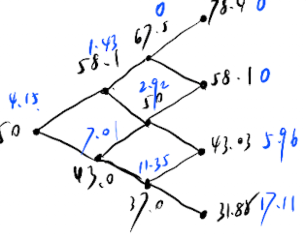
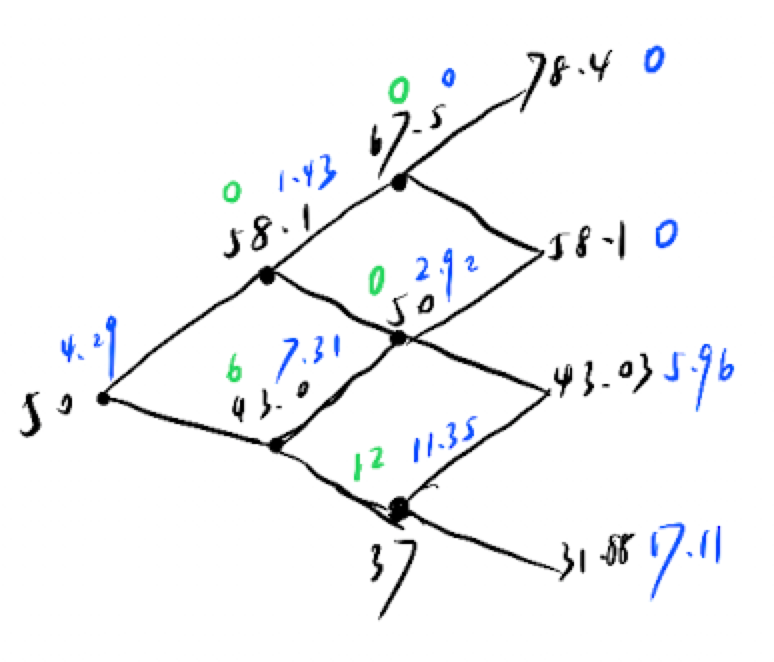
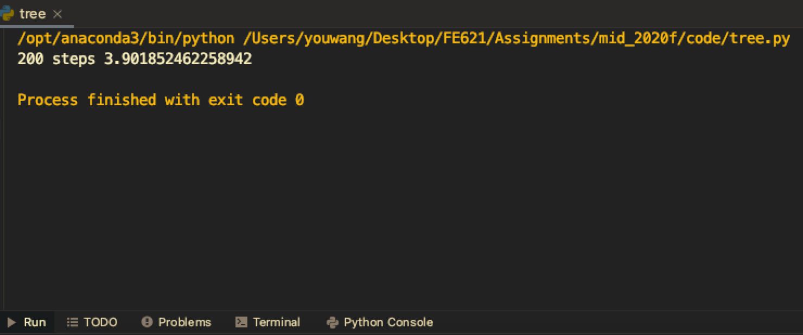

# Problem 1

For a binomial tree, its up size and down size($u$ and $d$) is given by:

$$
\begin{aligned}
    u &= e^{\sigma \sqrt{\Delta t}} \approx 1.16 \\
    d &= \frac{1}{u} \approx 0.86
\end{aligned}
$$

And probability of up and down is:

$$
\begin{aligned}
    p_u = \frac{e^{r \Delta t - d}}{u -d} \approx 0.5 \\
    p_d = 1 - p_u =0.5
\end{aligned}
$$

For a 3 step binomial tree, its structure is as following:


## Part (a)

In the following picture, black number is the stock price at the node, and blue number is the payoff at the node:



So its price is $4.15$.

To hedge it is to calculate the Delta:

$$\text{Delta} = e^{-r \Delta t}\frac{P_u - P_d}{S_u - S_d} \approx -0.37 $$

So we need to short 0.37 shares.

## Part (b)

In the following picture, black number is the stock price at the node, blue number is the discounted payoff at the node, green number is the payoff with early exercise:



So its price is $4.29$.

 calculate the Delta:

$$\text{Delta} = e^{-r \Delta t}\frac{P_u - P_d}{S_u - S_d} = -0.39$$

So we need to short 0.39 shares.

## Part (c)

In the following picture, black number is the stock price at the node, and blue number is the payoff at the node:


So its price is $1.42$.

# Problem 2

## (a)

For a 3 step trinomial tree model, $\Delta t = \frac{T}{3} = 0.25.$ Choose $\Delta x = \sigma \sqrt{3 \Delta t}$:

$$
\begin{aligned}
    u &= e^{\Delta x} \approx 1.30\\
    d &= \frac{1}{u} \approx 0.77 \\
    p_{v} &=\frac{1}{2}\left(\frac{\sigma^{2} \Delta t+v^{2} \Delta t^{2}}{\Delta x^{2}}+\frac{v \Delta t}{\Delta x}\right) \approx 0.17\\
    p_{m} &=1-\frac{\sigma^{2} \Delta t+v^{2} \Delta t^{2}}{\Delta x^{2}} \approx 0.67\\
    p_{d} &=\frac{1}{2}\left(\frac{\sigma^{2} \Delta t+v^{2} \Delta t^{2}}{\Delta x^{2}}-\frac{v \Delta t}{\Delta x}\right) \approx 0.16
\end{aligned}
$$

In the following picture, black number is the stock price at the node, blue number is the discounted payoff at the node, green number is the payoff with early exercise:


So its price is $3.59$.

## (b)

Because codes from Homework 2 contains some parts about barrier option, so I put it in the appendix. (See it [here](#appendix))



So its price is $3.90$.

# Problem 3

For an option price under a certain stochastic model satisfies the following PDE:

$$
\frac{\partial V}{\partial t}+\alpha(S) \frac{\partial V}{\partial S}+\beta(S) \frac{\partial^{2} V}{\partial S^{2}}-r V=0
$$

Transform stock price process to return process, which is:

$$
x = \log S
$$

Using chain rule,

$$
\begin{aligned}
    \frac{\partial V}{\partial S} &= \frac{1}{S} \frac{\partial V}{\partial x}\\
    \frac{\partial^{2} V}{\partial S^{2}} &= \frac{1}{S^2} \left(\frac{\partial^{2} V}{\partial x^{2}} - \frac{\partial V}{\partial x}\right)
\end{aligned}
$$

Therefore the initial PDE becomes

$$
\frac{\partial V}{\partial t}+\left(\frac{\alpha(S)}{S} - \frac{\beta(S)}{S^2}\right) \frac{\partial V}{\partial x}+\frac{\beta(S)}{S^2} \frac{\partial^{2} V}{\partial x^{2}}-r V=0
$$

In this problem, $\alpha = 2 \tan(S)$, $\beta = S^3$.

So the PDE is

$$
\frac{\partial V}{\partial t}+\left(\frac{\tan S}{S} - S\right) \frac{\partial V}{\partial x}+S \frac{\partial^{2} V}{\partial x^{2}}-r V=0
$$

## (a) Explicit Finite difference

Discretize the derivatives for explicit scheme:

$$
\frac{V_{i+1, j}-V_{i, j}}{\Delta t}+a_{i+1, j} \frac{V_{i+1, j+1}-V_{i+1, j-1}}{2 \Delta x}+b_{i+1, j} \frac{V_{i+1, j+1}-2 V_{i, j}+V_{i+1, j-1}}{\Delta x^{2}}-r V_{i+1, j}=0
$$

where $a_{i,j} = \frac{\tan(S_{i,j})}{S_{i,j}} - S_{i,j}$, $b_{i,j} = S_{i,j}$ at grid $(i,j)$. Also we know $S_{i,j} = S_0 e^{j\Delta x}$ at gird $(i,j)$.

Rearrange the equation:

$$\begin{aligned}
V_{i, j} &=p_{u} V_{i+1,j+1}+p_{m} V_{i+1, j}+p_{d} V_{i+1, j-1} \\
p_{u} &=\Delta t\left(\frac{b_{i+1, j}}{\Delta x^{2}}+\frac{a_{i+1, j}}{2 \Delta x}\right) \\
p_{m} &=1-\Delta t \frac{2 b_{i+1, j}}{\Delta x^{2}}-r \Delta t \\
p_{d} &=\Delta t\left(\frac{b_{i+1, j}}{\Delta x^{2}}-\frac{a_{i+1, j}}{2 \Delta x}\right)
\end{aligned}$$

## (b) Implicit Finite difference

Discretize the derivatives for implicit scheme:

$$
\frac{V_{i+1, j}-V_{i, j}}{\Delta t}+a_{i, j} \frac{V_{i, j+1}-V_{i, j-1}}{2 \Delta x}+b_{i, j} \frac{V_{i, j+1}-2 V_{i, j}+V_{i, j-1}}{\Delta x^{2}}-r V_{i, j}=0
$$

where $a_{i,j} = \frac{\tan(S_{i,j})}{S_{i,j}} - S_{i,j}$, $b_{i,j} = S_{i,j}$ at grid $(i,j)$. Also we know $S_{i,j} = S_0 e^{j\Delta x}$ at gird $(i,j)$.

Rearrange the equation:

$$\begin{aligned}
V_{i+1, j} &=p_{u} V_{i,j+1}+p_{m} V_{i, j}+p_{d} V_{i, j-1} \\
p_{u} &=-\Delta t\left(\frac{b_{i, j}}{\Delta x^{2}}+\frac{a_{i, j}}{2 \Delta x}\right) \\
p_{m} &=1+\Delta t \frac{2 b_{i, j}}{\Delta x^{2}}+r \Delta t \\
p_{d} &=-\Delta t\left(\frac{b_{i, j}}{\Delta x^{2}}-\frac{a_{i, j}}{2 \Delta x}\right)
\end{aligned}$$

Write it into matrix form, $Ax = b$:

$$
\left[\begin{array}{ccccccc}
1 & -1 & 0 & 0 & 0 & \ldots & 0 \\
p_u &p_m & p_d & 0 & 0 & \ldots & 0 \\
0 & p_u &p_m & p_d & 0 & \ldots & 0 \\
\vdots & \ddots & \ddots & \ddots & \ddots & \ddots & \vdots \\
0 & 0 & \ddots & \ddots & p_m & p_d & 0 \\
0 & 0 & 0 & \ddots & p_u &p_m & p_d \\
0 & 0 & 0 & \ldots & 0 & 1 & -1
\end{array}\right]\left[\begin{array}{c}
V_{i, N_{j}} \\
V_{i, N_{j}-1} \\
V_{i, N_{j}-2} \\
\vdots \\
\vdots \\
V_{i,-N_{j}+1} \\
V_{i,-N_{j}}
\end{array}\right]=\left[\begin{array}{c}
\lambda_{U} \\
V_{i+1, N_{j}-1} \\
V_{i+1, N_{j}-2} \\
\vdots \\
\vdots \\
V_{i+1,-N_{j}+1} \\
\lambda_{L}
\end{array}\right]
$$

Note that in this problem, $p_u, p_m, p_d$ in the matrix $A$ are not the same, its value depends on stock price at corresponding grid.

In (a) and (b), boundary condition is:

call option:

- When $S \rightarrow \infty$: $\frac{\partial V}{\partial S}=1$
- When $S \rightarrow 0_+$: $\frac{\partial V}{\partial S}=0$
  
put option:

- When $S \rightarrow \infty$: $\frac{\partial V}{\partial S}=0$
- When $S \rightarrow 0_+$: $\frac{\partial V}{\partial S}=1$

# Problem 4

**(e)**, **(g)**, **(h)** and **bonus** are right.

comment:

- **(e)**: $\log \frac{S_{i+1}}{s_i} <= \frac{S_{i+1} - S_i}{S_i}$, when $S_{i+1} = S_{i}$ they are equal. We can easily find it by let $u = \frac{S_{i+1}}{S_i}$ and define a function $f(x) = x - \log x - 1$.
- **(h)**: Under Q-measure we can do it.
- **bonus**: we can easily do this using Cholesky Decomposition.

The others are false:

- **(a)**: The price of an European Call option written for a stock that does not pay dividends is always higher than its intrinsic value. Therefore, in that case, Prices of European and American Call options are equal.
- **(b)**: Explicit Finite Difference scheme takes boundary conditions into account, while trinomial tree model does not.
- **(c)**: We need to choose steps for explicit finite difference scheme.
- **(d)**: The discount factor has been considered in $p_u, p_m, p_d$.
- **(f)**: We need to consider their correlations.
- **(g)**: To hedge risk we also need to short bonds.

# Appendix

Codes of Problem 2 part b:

```python
def trinomial_tree(S, K, barrier, T, r, sigma, N, Type, style):
    # check illegal Type and style
    if Type not in ['c', 'p']:
        raise TypeError("option type should be 'c' for call,"
                        "'p' for put")
    if style not in ['e', 'a']:
        raise TypeError("option style should be 'a' for American option,"
                        "'e' for European option")
    # initialization
    t = T / N
    D = r - sigma ** 2 / 2
    delta_x = sigma * np.sqrt(3 * t)
    p_u = 0.5 * ((sigma ** 2 * t + D ** 2 * t ** 2) / delta_x ** 2 + D * t / delta_x)
    p_m = 1 - (sigma ** 2 * t + D ** 2 * t ** 2) / delta_x ** 2
    p_d = 0.5 * ((sigma ** 2 * t + D ** 2 * t ** 2) / delta_x ** 2 - D * t / delta_x)
    print(delta_x)
    u = np.exp(delta_x)
    print(u, 1/u)
    print(p_u, p_m, p_d)
    def tree_construction():
        s = [np.array([S])]
        for i in range(N):
            temp = np.exp(delta_x) * s[i]
            temp = np.append(temp, s[i][-1])
            temp = np.append(temp, s[i][-1] * np.exp(-delta_x))
            s.append(temp)
        return s

    # payoff
    def payoff(s):
        if Type == 'c':
            return np.maximum(s - K, 0)
        elif Type == 'p':
            return np.maximum(K - s, 0)
        else:
            raise TypeError("Illegal option type!")

    def backward(s, p):
        temp1 = np.roll(p, -1)
        temp2 = np.roll(p, -2)
        temp = p * p_u + temp1 * p_m + temp2 * p_d
        temp = temp * np.exp(-r * t)
        temp = np.delete(temp, -1)
        temp = np.delete(temp, -1)
        if style == 'e':
            return temp
        elif style == 'a':
            current_p = payoff(s)
            temp = np.maximum(temp, current_p)
            return temp

    def backward_barrier(s, p):
        temp1 = np.roll(p, -1)
        temp2 = np.roll(p, -2)
        temp = p * p_u + temp1 * p_m + temp2 * p_d
        temp = temp * np.exp(-r * t)
        temp = np.delete(temp, -1)
        temp = np.delete(temp, -1)
        if barrier[1] == 'D':
            temp[s <= barrier[0]] = 0
            if style == 'e':
                return temp
            elif style == 'a':
                current_p = payoff(s)
                temp = np.maximum(temp, current_p)
                temp[s <= barrier[0]] = 0
                return temp
        elif barrier[1] == 'U':
            temp[s >= barrier[0]] = 0
            if style == 'e':
                return temp
            elif style == 'a':
                current_p = payoff(s)
                temp = np.maximum(temp, current_p)
                temp[s >= barrier[0]] = 0
                return temp

    s = tree_construction()
    s_t = s[-1]
    print('s')
    print(s)
    p = payoff(s_t)
    # without barrier
    if barrier == 0:
        p = payoff(s_t)
        print("p")
        print(p)
        while len(p) > 1:
            p = backward(s[len(p) // 2 - 1], p)
            print(p)
        return float(p)

    # with barrier
    if barrier[1] == 'D':
        p[s_t <= barrier[0]] = 0
    elif barrier[1] == 'U':
        p[s_t >= barrier[0]] = 0
    if barrier[2] == 'O':
        while len(p) > 1:
            p = backward_barrier(s[len(p) // 2 - 1], p)
        return float(p)
    elif barrier[2] == 'I':
        out = trinomial_tree(S, K, [barrier[0], barrier[1], 'O'], T, r, sigma, N, Type, style)
        v = trinomial_tree(S, K, 0, T, r, sigma, N, Type, style)
        return v - out


if __name__ == '__main__':
    S = 50
    K = 49
    r = 0.05
    sigma = 0.3
    T = 0.75
    N = 200
    print(trinomial_tree(S, K, 0, T, r, sigma, N, 'p', 'a'))
```
